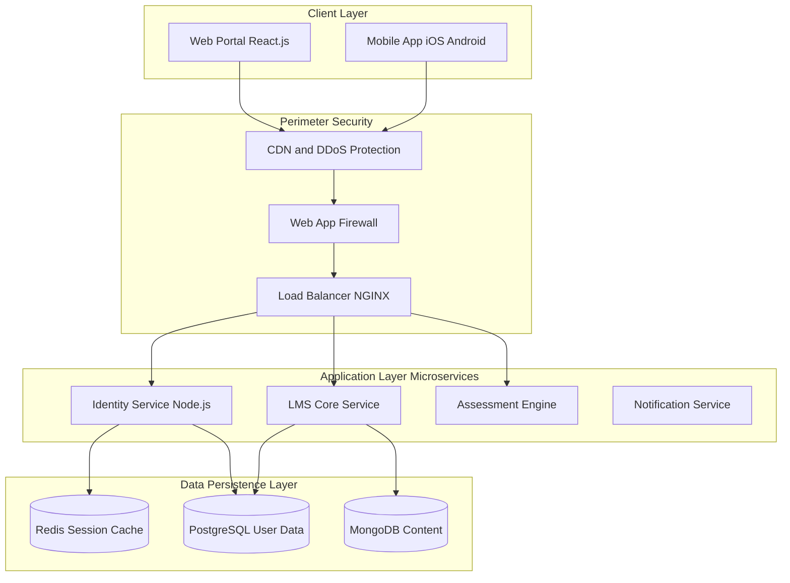

# Phase 1 Understand System Architecture and Security Analysis

**Project** Madrasati Security Framework  
**Date** November 2025  
**Version** 3.0 Narrative Edition

---

## 1.1 Executive Summary

The Madrasati platform serves as the digital backbone of Saudi Arabia's education system supporting over 6 million active users including students teachers and parents. This document outlines the Understand phase of the security framework providing a deep architectural analysis and threat landscape assessment. Our objective is to secure this critical infrastructure against evolving cyber threats while ensuring compliance with the National Cybersecurity Authority NCA controls and the Personal Data Protection Law PDPL. The analysis presented herein establishes the foundation for all subsequent security engineering efforts.

## 1.2 System Architecture Overview

The platform is engineered as a cloud native microservices based system designed for high availability and fault tolerance. The architecture prioritizes scalability to handle the massive concurrent load during morning assemblies and exam periods.

### High Level Architecture Diagram

### Component Analysis

The Public Gateway serves as the first line of defense for the infrastructure. The Content Delivery Network CDN offloads static content such as textbooks and educational videos to edge locations which significantly reduces latency for end users and absorbs volumetric DDoS attacks before they reach the core network. Behind the CDN the Web Application Firewall WAF inspects all incoming HTTP and HTTPS traffic for malicious payloads specifically targeting OWASP Top 10 attacks like SQL injection and Cross Site Scripting. The NGINX Load Balancer then distributes the sanitized traffic across healthy instances and handles SSL TLS termination to offload cryptographic processing from the backend servers.

The Application Layer is composed of specialized microservices. The Identity Service acts as the gatekeeper handling user authentication session management and integration with Nafath for the National Single Sign On. It issues JSON Web Tokens JWT for stateless authorization across the platform. The LMS Core manages the daily educational workflow including attendance tracking assignment submissions and virtual classroom interactions. The Assessment Engine is a high security isolated service dedicated to exam delivery implementing stricter rate limiting and logging than other services to ensure exam integrity.

The Data Layer utilizes a polyglot persistence strategy. PostgreSQL stores relational data requiring ACID compliance such as User Profiles Grades and School Hierarchy. MongoDB is utilized for unstructured data like lesson plans and rich media content allowing for flexible content management. Redis provides sub millisecond access to active session tokens and temporary cache data ensuring high performance for user session validation.

## 1.3 CIA Triad Security Analysis

We apply the Confidentiality Integrity and Availability CIA model to categorize risks and controls ensuring a comprehensive security posture.

### Confidentiality The Secret Pillar

Confidentiality ensures that sensitive information is accessible only to authorized individuals. In the context of Madrasati the critical assets include Student Personally Identifiable Information PII such as National IDs phone numbers and home addresses. Additionally unreleased exam questions and answer keys must remain strictly confidential before the scheduled exam time. Teacher notes regarding student behavior are also sensitive and require protection.

The primary risks to confidentiality include data breaches that could lead to identity theft and exam leaks that would compromise the integrity of national testing. To mitigate these risks we have implemented AES 256 GCM encryption for all database volumes at rest. For data in transit we enforce TLS 1.3 with strong cipher suites for all network traffic. Furthermore National IDs are masked in the user interface for non privileged users to prevent casual exposure.

### Integrity The Trust Pillar

Integrity involves maintaining the accuracy and completeness of data throughout its lifecycle. The critical assets for integrity include academic records such as final grades and transcripts as well as attendance logs which serve as legal records of student presence.

The risks associated with integrity violations are severe. Unauthorized grade modification such as a student hacking the system to change a failing grade to a passing one would undermine the validity of the entire educational system. Corruption of attendance records could also affect school funding or legal standing. To protect integrity we employ digital signatures where grades are cryptographically signed upon submission. All write operations are logged to a Write Once Read Many WORM storage system to create immutable audit logs. Strict server side input validation is also enforced to prevent malformed data injection.

### Availability The Uptime Pillar

Availability ensures that the system is operational and accessible when needed. The critical periods for Madrasati are the morning rush from 7 00 AM to 8 00 AM when millions of students log in simultaneously and during final exam weeks when downtime is not tolerated.

The risks to availability include Distributed Denial of Service DDoS attacks aiming to disrupt exams and system overload due to poor scaling configurations. To ensure availability we utilize auto scaling infrastructure that automatically adds servers based on CPU and memory load. Rate limiting is implemented to restrict the number of requests per IP address preventing abuse. Database replication across multiple Availability Zones AZs ensures that data remains accessible even if one data center fails.

### Asset Classification Table

| Asset Name | Classification | CIA Priority | Primary Owner | Security Control |
|---|---|---|---|---|
| **Student National ID** | Restricted | Confidentiality | Identity Service | AES 256 Encryption Data Masking |
| **Final Exam Questions** | Top Secret | Confidentiality | Assessment Engine | Time Locked Access Encryption |
| **Student Grades** | Restricted | Integrity | LMS Core | Digital Signatures Audit Logs |
| **Attendance Records** | Internal | Integrity | LMS Core | WORM Storage RBAC |
| **Lesson Content** | Public | Availability | Content Service | CDN Caching Redundancy |
| **User Password Hash** | Restricted | Confidentiality | Identity Service | Bcrypt Hashing Salted |

## 1.4 Comprehensive Threat Landscape

We have identified three primary threat categories relevant to the Saudi educational context ranging from internal actors to state sponsored entities.

### Threat 1 The Insider Academic Dishonesty

The insider threat primarily consists of tech savvy students or compromised teacher accounts. The motivation for these actors is typically grade improvement exam theft or reputation damage. Attack vectors include session hijacking where an attacker steals a teacher's active session cookie and parameter tampering where API requests are modified to access unauthorized data. Social engineering is also a significant risk with students attempting to phish teachers to steal credentials. The impact of these attacks is high as they compromise the fairness and credibility of the education system.

### Threat 2 The Extortionist Ransomware

Organized cybercriminal groups such as LockBit or Rhysida pose a significant threat to educational institutions. Their primary motivation is financial gain via ransom payments. Common attack vectors include phishing emails with malicious attachments sent to school administrators and the exploitation of vulnerabilities in unpatched VPNs or RDP servers. The impact of a successful ransomware attack is catastrophic potentially leading to the loss of all historical data and extended downtime for the entire platform.

### Threat 3 The Saboteur State Sponsored

Advanced Persistent Threats APTs from hostile nations represent a strategic threat to national infrastructure. The motivation behind these attacks is the destabilization of critical services and the creation of social unrest. Attack vectors include massive DDoS attacks timed to coincide with national exams and the deployment of wiper malware designed to permanently delete data rather than encrypt it. The impact of such attacks would be a national security crisis and a significant loss of public trust in government services.

## 1.5 Regulatory Alignment

This framework is strictly aligned with national regulations to ensure compliance and data protection.

The National Cybersecurity Authority NCA Essential Cybersecurity Controls ECC are fully implemented. ECC 1 1 covers Cybersecurity Governance ensuring that policies and procedures are in place. ECC 2 1 addresses Asset Management requiring a complete inventory of all hardware and software assets. ECC 3 1 mandates strict Identity and Access Management controls to protect user accounts.

The Personal Data Protection Law PDPL is also a cornerstone of our security strategy. We ensure data minimization by collecting only the information that is strictly needed for educational purposes. Breach notification procedures are established to inform affected individuals and authorities in the event of a data compromise. Furthermore clear user consent is required for all data processing activities ensuring transparency and respect for user privacy.
