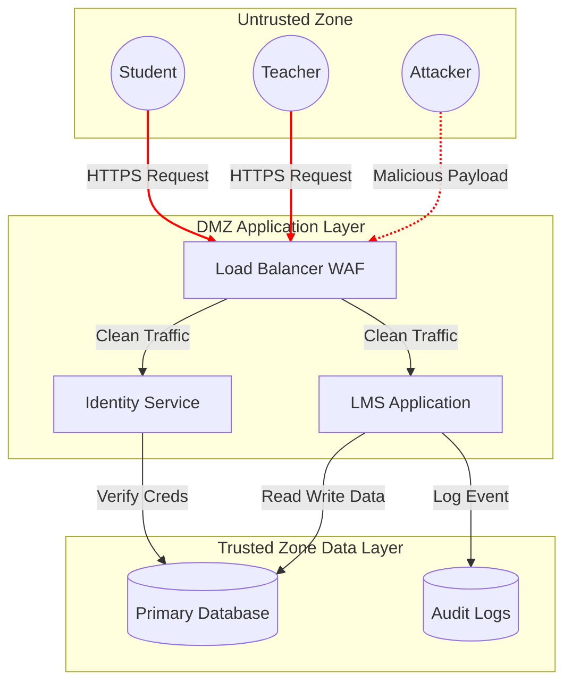
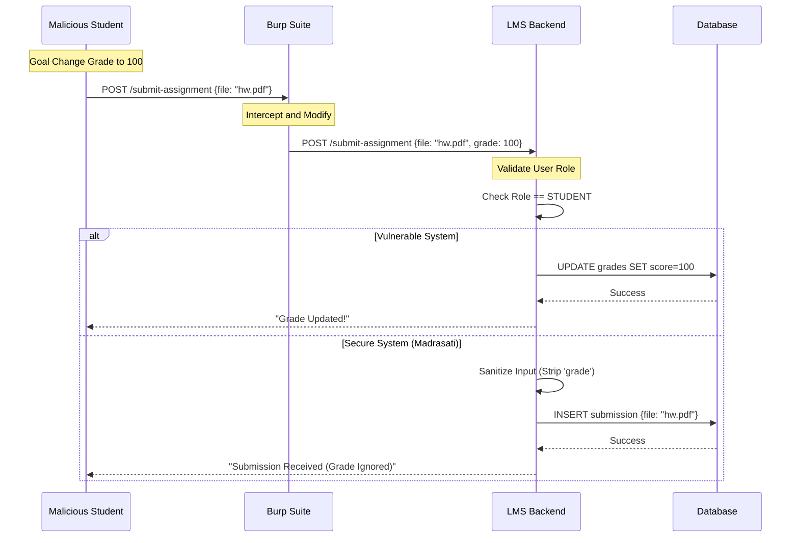

# Phase 2 Practice Threat Modeling and STRIDE Analysis

**Project** Madrasati Security Framework  
**Date** November 2025  
**Version** 3.0 Narrative Edition

---

## 2.1 Introduction

In the Practice phase we move from theoretical understanding to concrete analysis. We utilize the STRIDE methodology Spoofing Tampering Repudiation Information Disclosure Denial of Service Elevation of Privilege to systematically identify vulnerabilities within the Madrasati application architecture. This structured approach allows us to uncover potential security flaws before they can be exploited by malicious actors.

## 2.2 Threat Model Diagram

The following diagram illustrates the data flow and trust boundaries within the system. The red dashed lines indicate where data crosses from a lower trust level to a higher trust level. These boundaries are the critical points for security controls as they represent the interface between untrusted inputs and trusted assets.

## 2.3 Detailed STRIDE Analysis

We have analyzed the application against the six STRIDE categories to ensure comprehensive coverage of potential threats.

### Spoofing Identity

Spoofing involves an attacker pretending to be another user or system entity. A likely scenario in our environment is a student intercepting a teacher's session cookie over an insecure Wi Fi network and using it to log in as the teacher. To mitigate this risk we enforce the use of Secure cookies which are only transmitted over HTTPS and HttpOnly cookies which are inaccessible to JavaScript. Additionally user sessions are configured to automatically expire after 30 minutes of inactivity and Multi Factor Authentication MFA is required for critical actions like grade finalization.

### Tampering with Data

Tampering refers to the malicious modification of data. An attacker might use a browser proxy tool such as Burp Suite to intercept the Submit Assignment request and change the grade parameter from null to 100. Our mitigation strategy involves strict server side validation where the backend explicitly ignores the grade parameter when the request originates from a student role. Furthermore critical records are hashed and any mismatch between the data and the hash triggers an immediate security alert.

### Repudiation

Repudiation occurs when a user denies having performed an action. For example a teacher might change a student's grade for a bribe and later claim that they did not do it or that the system has a bug. To prevent this we implement immutable audit logs. Every write operation records the User ID Timestamp IP Address Old Value and New Value. Database triggers are also used to ensure automatic logging at the database level preventing application logic from bypassing the audit trail.

### Information Disclosure

Information disclosure involves exposing sensitive information to unauthorized users. A potential vulnerability could be an API endpoint that returns the full database record for every student in a search result including their National ID and home address even though the UI only displays the name. We mitigate this by using Data Transfer Objects DTOs where the backend maps database entities to strict response objects that only include public fields. We also ensure that login failures return generic error messages to prevent username enumeration.

### Denial of Service DoS

Denial of Service attacks aim to make the system unavailable to legitimate users. An attacker might run a script to submit the login form thousands of times per second exhausting the database connection pool. To defend against this we implement rate limiting which restricts login attempts to 5 per 15 minutes per IP address. We also enforce resource limits on the server setting a maximum body size for requests to prevent large payload attacks.

### Elevation of Privilege

Elevation of privilege occurs when a user gains capabilities they should not have. A student might attempt to change the URL from the student dashboard to the admin dashboard to access administrative functions. Our mitigation relies on Role Based Access Control RBAC middleware that checks the user's role on every single request. If a student requests an admin route the server immediately returns a 403 Forbidden response.

### STRIDE Threat Matrix

| Threat Category | Specific Scenario | Probability | Impact | Mitigation Strategy |
|---|---|---|---|---|
| **Spoofing** | Student steals Teacher Session ID | Medium | High | HttpOnly Cookies MFA Short Sessions |
| **Tampering** | Modifying Grade in API Request | High | Critical | Server Side Validation Digital Signatures |
| **Repudiation** | Teacher denies changing grade | Low | High | Immutable Audit Logs WORM |
| **Info Disclosure** | API leaks National ID | Medium | High | Data Transfer Objects DTOs |
| **DoS** | Login page flooding | High | Medium | Rate Limiting CAPTCHA |
| **Privilege Escalation** | Student accesses Admin URL | High | Critical | Strict RBAC Middleware |

## 2.4 Attack Flow Simulation

To better understand the Tampering threat we simulate a specific attack path The Grade Modification Attempt.

This diagram clearly shows how the security control Input Sanitization neutralizes the attack. In the secure system even though the attacker sends the malicious parameter the server logic explicitly discards it based on the user's role preserving data integrity.
