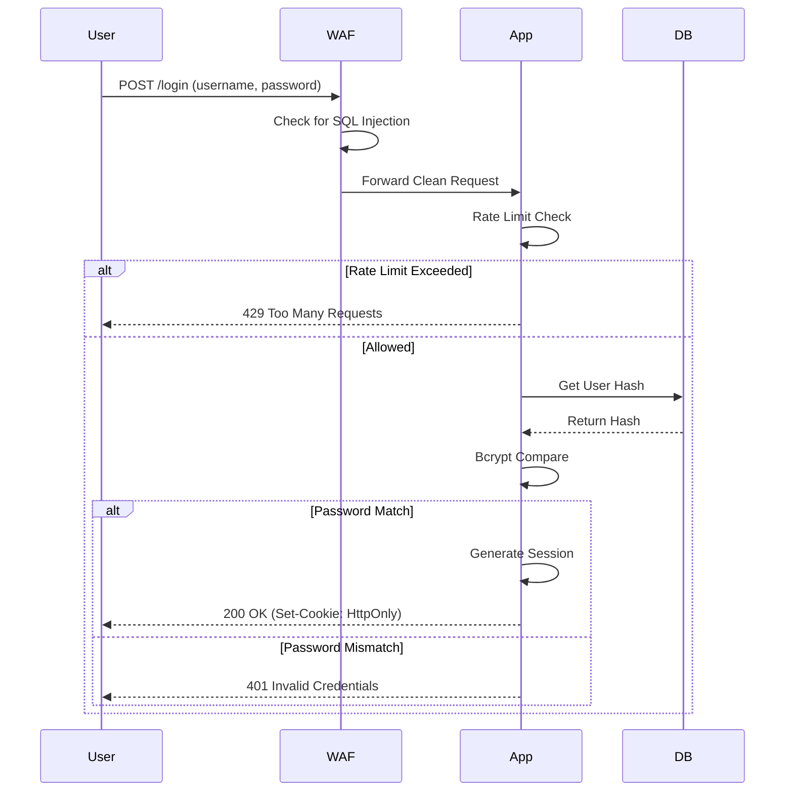

# Phase 3 Master Security Implementation and Code

**Project** Madrasati Security Framework  
**Date** November 2025  
**Version** 3.0 Narrative Edition

---

## 3.1 Introduction

The Master phase focuses on the concrete implementation of security controls. We have translated the architectural requirements into production ready Node.js code. This section details the Defense in Depth strategy and provides the actual code used in the demo application. Our approach ensures that security is baked into the development lifecycle rather than being an afterthought.

## 3.2 Security Architecture Layers

We implement security at four distinct layers to ensure that if one fails others remain to protect the system. This multi layered approach provides robust protection against a wide variety of attack vectors.

**Layer 1 Edge Security** focuses on stopping attacks before they reach our infrastructure. We utilize Cloudflare WAF DDoS protection and IP Reputation filtering to block volumetric attacks and known malicious actors at the network edge.

**Layer 2 Network Security** isolates our internal resources. We use a Virtual Private Cloud VPC with Security Groups and Private Subnets to ensure that the database cannot be accessed directly from the internet reducing the attack surface significantly.

**Layer 3 Application Security** ensures that only valid requests from authorized users are processed. This layer includes Input Validation Authentication Authorization RBAC and Secure Session Management controls embedded directly into the application logic.

**Layer 4 Data Security** renders stolen data useless to attackers. We employ AES 256 encryption for data at rest Bcrypt hashing for passwords and regular backups to ensure data recoverability in case of corruption or loss.

### Security Controls Mapping Table

| Security Layer | Control Name | Technology Used | Primary Purpose |
|---|---|---|---|
| **Edge** | Web App Firewall | Cloudflare AWS WAF | Block SQLi XSS and Bot traffic |
| **Network** | Network Isolation | VPC and Security Groups | Prevent direct database access |
| **Application** | Authentication | Passport.js JWT | Verify user identity |
| **Application** | Authorization | Custom Middleware | Enforce Role Based Access RBAC |
| **Application** | Input Validation | Validator.js | Prevent injection attacks |
| **Data** | Encryption | AES 256 GCM | Protect sensitive data at rest |
| **Data** | Password Hashing | Bcrypt Salted | Protect user credentials |

## 3.3 Core Security Implementations

The following code snippets are taken directly from the `src` directory of the project and demonstrate our secure coding practices.

### Secure Authentication Service

We use `bcrypt` for password hashing. This is superior to simple SHA 256 because it includes a work factor salt rounds that makes brute force attacks computationally expensive. The login function also checks for account lockouts to prevent brute force attempts.

```javascript
// src/auth-service.js
const bcrypt = require('bcrypt');
const SALT_ROUNDS = 12; // High work factor for security

async function loginUser(username, password) {
    // 1. Retrieve user from database
    const user = await db.users.findOne({ username });
    
    // 2. Generic error message to prevent enumeration
    if (!user) throw new Error('Invalid username or password');

    // 3. Check Account Lockout
    if (user.failedAttempts >= 5 && Date.now() < user.lockoutUntil) {
        throw new Error('Account locked. Try again in 15 minutes.');
    }

    // 4. Secure Password Comparison
    const match = await bcrypt.compare(password, user.passwordHash);
    
    if (!match) {
        await incrementFailedAttempts(user);
        throw new Error('Invalid username or password');
    }

    // 5. Reset counters on success
    await resetFailedAttempts(user);
    return generateSession(user);
}
```

### Role Based Access Control RBAC Middleware

This middleware is the backbone of our authorization strategy. It runs before every protected route controller and ensures that the user has the necessary permissions to access the requested resource.

```javascript
// src/middleware/rbac.js
function requireRole(requiredRole) {
    return (req, res, next) => {
        // Ensure user is logged in
        if (!req.session || !req.session.user) {
            return res.status(401).send('Unauthorized');
        }

        // Check role hierarchy
        const userRole = req.session.user.role;
        if (userRole !== requiredRole && userRole !== 'admin') {
            // Log the unauthorized attempt
            console.warn(`Security Alert: User ${req.session.user.id} attempted to access ${req.path}`);
            return res.status(403).send('Forbidden: Insufficient Permissions');
        }

        next(); // Proceed to controller
    };
}
```

### Input Validation Sanitization

We use a whitelist approach for input validation. Instead of trying to block bad characters we only allow good characters. This significantly reduces the risk of injection attacks by ensuring that only expected data formats are processed.

```javascript
// src/utils/validator.js
const validator = require('validator');

function validateStudentInput(data) {
    const errors = {};

    // Name: Allow only letters and spaces
    if (!/^[a-zA-Z\s]+$/.test(data.name)) {
        errors.name = 'Name must contain only letters';
    }

    // Email: Strict format check
    if (!validator.isEmail(data.email)) {
        errors.email = 'Invalid email format';
    }

    // Grade: Must be a number 0-100
    if (data.grade && !validator.isInt(data.grade.toString(), { min: 0, max: 100 })) {
        errors.grade = 'Grade must be between 0 and 100';
    }

    return {
        isValid: Object.keys(errors).length === 0,
        errors
    };
}
```

### Secure Session Configuration

We configure `express-session` with strict security flags to prevent XSS and CSRF attacks. The `HttpOnly` flag prevents client side scripts from accessing the cookie while `Secure` ensures it is only sent over HTTPS. `SameSite` strict mode prevents the cookie from being sent with cross site requests.

```javascript
// src/server.js
app.use(session({
    secret: process.env.SESSION_SECRET, // Loaded from .env
    name: 'madrasati_sid', // Hide default 'connect.sid' name
    resave: false,
    saveUninitialized: false,
    cookie: {
        httpOnly: true, // Prevents JavaScript access (XSS protection)
        secure: true,   // Ensures cookie is sent only over HTTPS
        sameSite: 'strict', // Prevents CSRF attacks
        maxAge: 30 * 60 * 1000 // 30 minutes
    }
}));
```

### Rate Limiting

To protect against Brute Force and DoS attacks we limit the number of requests a single IP can make. This prevents attackers from overwhelming the login endpoint with thousands of password guesses.

```javascript
// src/middleware/rate-limit.js
const rateLimit = require('express-rate-limit');

const loginLimiter = rateLimit({
    windowMs: 15 * 60 * 1000, // 15 minutes
    max: 5, // Limit each IP to 5 login requests per window
    message: 'Too many login attempts from this IP, please try again after 15 minutes',
    standardHeaders: true, // Return rate limit info in headers
    legacyHeaders: false,
});

app.use('/api/login', loginLimiter);
```

## 3.4 Security Architecture Diagram

The following sequence diagram illustrates the secure login flow demonstrating how the components interact to enforce security.


