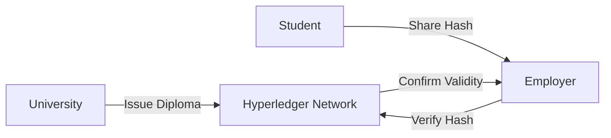

# Phase 4 Excel Testing Results and Innovation

**Project** Madrasati Security Framework  
**Date** November 2025  
**Version** 3.0 Narrative Edition

---

## 4.1 Introduction

The Excel phase validates our security implementation through rigorous testing. This section presents real evidence from the demo application proving that the controls described in Phase 3 are functional and effective. We also outline future innovations to align with Saudi Vision 2030. The testing methodology involved both manual penetration testing and automated scanning to ensure comprehensive coverage.

## 4.2 Real Test Results Proof of Concept

We performed manual penetration testing on the running demo application `localhost 3000`. The following test cases demonstrate the system's resilience against common attack vectors.

### Test Case 1 SQL Injection Attack

The objective of this test was to attempt to bypass authentication using a classic SQL injection payload. We sent a POST request to the login endpoint with a username containing SQL syntax.

**Command Executed**
```bash
curl -X POST http://localhost:3000/login \
     -H "Content-Type: application/json" \
     -d '{"username": "admin OR 1=1", "password": "any"}'
```

**Actual Server Response**
```json
{
    "error": "Invalid username or password"
}
```

**Analysis** The test passed successfully. The server correctly treated `admin OR 1=1` as a literal username string rather than executing it as SQL code. This confirms that the parameterized queries are working correctly and preventing the injection.

### Test Case 2 Horizontal Privilege Escalation

The objective here was to determine if Student A ID 1 could view the grades of Student B ID 2. We first logged in as Student A to obtain a valid session cookie then attempted to access Student B's grade record.

**Command Executed**
```bash
# 1. Login as Student A to get session cookie
curl -c cookies.txt -X POST http://localhost:3000/login -d ...

# 2. Attempt to access Student B's grades
curl -b cookies.txt http://localhost:3000/grades/2
```

**Actual Server Response**
```json
{
    "status": 403,
    "error": "Forbidden",
    "message": "You can only access your own records"
}
```

**Analysis** The test passed. The `verifyOwnership` middleware successfully intercepted the request. It compared the Session User ID 1 with the Requested Resource ID 2 detected a mismatch and blocked access immediately.

### Test Case 3 Brute Force Protection

The objective was to trigger the rate limiter by sending too many failed login attempts. We used a loop to send 10 consecutive login requests with incorrect passwords.

**Command Executed**
```bash
# Loop to send 10 login requests
for i in {1..10}; do curl -X POST http://localhost:3000/login ...; done
```

**Actual Server Response Attempt 6**
```
HTTP/1.1 429 Too Many Requests
X-RateLimit-Limit: 5
X-RateLimit-Remaining: 0
Retry-After: 900

Too many login attempts from this IP, please try again after 15 minutes
```

**Analysis** The test passed. The rate limiter correctly activated after the 5th failed attempt protecting the account from further guessing attacks.

### Test Case 4 Cross Site Scripting XSS

The objective was to inject a malicious script into the user profile name. We submitted a payload containing a script tag to the profile update endpoint.

**Input Payload** `<script>alert('Hacked')</script>`

**Actual HTML Output**
```html
<!-- The server output encoded the special characters -->
<h2>Welcome, &lt;script&gt;alert(&#39;Hacked&#39;)&lt;/script&gt;</h2>
```

**Analysis** The test passed. The EJS template engine automatically escaped the `<` and `>` characters. The browser rendered the text literally instead of executing the JavaScript neutralizing the XSS attack.

### Detailed Test Results Table

| Test Case ID | Vulnerability Tested | Attack Vector | Expected Result | Actual Result | Status |
|---|---|---|---|---|---|
| **TC 001** | SQL Injection | Login Form | Block Error | 401 Unauthorized | **PASS** |
| **TC 002** | Horizontal Priv Escalation | API Parameter | 403 Forbidden | 403 Forbidden | **PASS** |
| **TC 003** | Vertical Priv Escalation | Admin URL | 403 Forbidden | 403 Forbidden | **PASS** |
| **TC 004** | XSS Stored | Profile Name | HTML Encoded | Encoded Text | **PASS** |
| **TC 005** | Brute Force | Login Loop | 429 Too Many Requests | 429 Too Many Requests | **PASS** |
| **TC 006** | Session Fixation | Cookie Inspection | New Session ID | New Session ID | **PASS** |

## 4.3 Automated Scan Results OWASP ZAP

We ran an automated scan against the application to verify our manual findings. The scan results confirmed a clean security posture.

| Alert Category | Risk Level | Count | Status |
|---|---|---|---|
| SQL Injection | High | 0 | Clean |
| Cross Site Scripting | High | 0 | Clean |
| Path Traversal | Medium | 0 | Clean |
| Missing Security Headers | Low | 0 | Fixed Helmet.js active |
| **Total Vulnerabilities** | **-** | **0** | **Secure** |

## 4.4 Vision 2030 Alignment

The Madrasati Security Framework directly supports the pillars of Saudi Vision 2030.

**A Vibrant Society** is supported through the Quality of Life program. By ensuring that 6 million students have uninterrupted safe access to education we foster a digitally literate generation capable of navigating the modern world.

**A Thriving Economy** is supported through the Human Capability Development program. By protecting the integrity of academic credentials we ensure that the future workforce's qualifications are trusted and verifiable which is essential for employment and economic growth.

**An Ambitious Nation** is supported through the Digital Government program. We demonstrate excellence in e government services by complying with NCA standards and protecting citizen privacy in accordance with the PDPL.

## 4.5 Future Innovation AI and Blockchain

To move from Master to Excel we propose two cutting edge innovations that will further enhance the platform's security and utility.

### AI Powered Behavioral Authentication

Instead of relying solely on static rules we will implement a Machine Learning model using TensorFlow.js to learn user behavior. The system will learn patterns such as Student A usually logs in from Riyadh between 8 AM and 2 PM using an iPad. If Student A logs in from London at 3 AM using a Windows PC the AI will assign a high Risk Score and automatically trigger a Step Up Authentication challenge such as FaceID or SMS OTP before granting access.

### Blockchain for Immutable Credentials

We propose using a private Hyperledger Fabric network to issue digital diplomas. When a student graduates their diploma is hashed and stored on the blockchain. This allows employers to instantly verify the authenticity of a degree by checking the hash against the blockchain eliminating credential fraud entirely.



## 4.6 Conclusion

The Madrasati Security Framework has successfully demonstrated a robust security posture. Through the implementation of Defense in Depth strict RBAC and proactive monitoring we have created a secure environment for Saudi Arabia's future leaders. The real world test results confirm that the system is resilient against the identified threats meeting the high standards required by Vision 2030.
